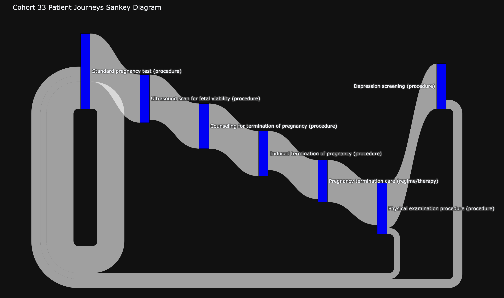

# Snowflake Graph Analytics
## Worked Example: Patient Journey

This example shows how to use Neo4j Graph Analytics within Snowflake to analyze life sciences data, focusing on patient journey analytics. Specifically, this example shows how to:

1. __Segment patient into cohorts__ based on medical history (graph algos: node similarity & louvain community detection)
2. __Provide insights into cohort demographic, encounter & journey patterns__ computing statistics and visualization with sankey diagrams



## Dataset
We use [Synthea](https://github.com/synthetichealth/synthea) to simulate realistic patient data. 

## Prerequisites

### 1) Get Source Data
Get source csvs either from [here](https://drive.google.com/drive/folders/14bbDMnLU7beW1f79Rjr4J2b7hw3mCIQJ?usp=sharing) or by running [Synthea](https://github.com/synthetichealth/synthea)  per directions below:

Change `exporter.csv.export = true` in `synthea.properties` then use the following options
```bash
./run_synthea -s 7474 -p 1000
```
### 2) Load Source Data
Crete a `PATIENT_DB` database and load the following csvs into `PUBLIC` schema:
1. PATIENTS
2. PROCEDURES
Note: When you import PROCEDURES you will receive a warning that START is a reserved keyword. This Notebook assumes START has been replaced by START_TIME, if you want to use something different you will need to change the SQL in pj-demo-step2-graph-algos.sql under the comment 'create sankey view'
## Running the Example

### Steps
1. Run [pj-demo-step1-nodes-and-rels.sql](pj-demo-step1-nodes-and-rels.sql) to map source tables to graph nodes and relationships
2. Run [pj-demo-step2-graph-algos.sql](pj-demo-step2-graph-algos.sql) to run graph algorithms for patient cohort segmentation
3. Run the notebook [P2P_DEMO_STEP3_ER.ipynb](pj-demo-step3-insights.ipynb) to visualize results and perform demographic, encounter & journey pattern analysis. 
